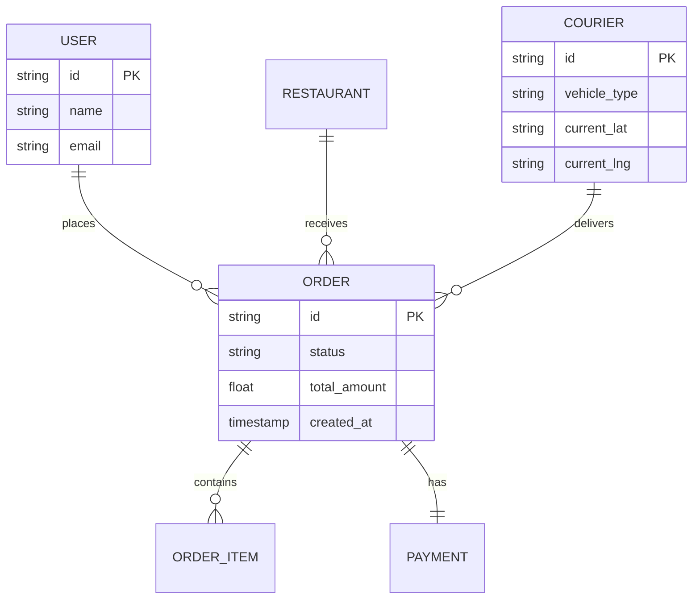

# Example: Food Delivery App Requirements (FastBite)

This is a complete example of a requirements document generated using the **Business Requirements Analyst** methodology.

---

## 1. Business Vision

### 1.1 Problem Solved

Customers struggle to find diverse local food options with reliable, real-time tracking, while small restaurants lacks the infrastructure to manage their own delivery fleet.

### 1.2 Value Proposition

FastBite provides a unified marketplace with a high-performance delivery network and a state-of-the-art real-time GPS tracking system for both customers and restaurants.

---

## 2. Business Processes

### 2.1 Order-to-Delivery Flow

1. Customer places order via App.
2. System validates payment (ADR-002).
3. Restaurant accepts order.
4. Courier is assigned based on proximity.
5. Courier picks up and delivers.

---

## 3. Functional Requirements (EARS Syntax)

| ID        | Requirement                                                                                       | EARS Pattern      | Traceability    |
| --------- | ------------------------------------------------------------------------------------------------- | ----------------- | --------------- |
| **FR-01** | **WHEN** the user confirms the order **THE** System shall initiate the payment process.           | Event-Driven      | @brd: BRD.01.01 |
| **FR-02** | **IF** the payment fails **THEN** the System shall notify the user and allow a retry.             | Unwanted Behavior | @brd: BRD.01.05 |
| **FR-03** | **WHILE** the courier is in transit **THE** System shall update the GPS location every 5 seconds. | State-Driven      | @brd: BRD.02.01 |

---

## 4. Data Model (Auto-generated ERD)

---

## 5. Architecture Decision Records (ADR)

### ADR-001: Use of PostgreSQL

**Decision:** Use PostgreSQL for the main transactional database.
**Rationale:** Need ACID compliance for financial transactions and robust relational mapping for complex orders.

### ADR-002: Stripe Integration

**Decision:** Use Stripe as the primary payment gateway.
**Rationale:** PCI-DSS compliance out of the box and superior API for split payments (Restaurant/Courier/Platform).

---

## 6. Traceability Matrix

| Requirement ID | Business Goal       | ADR Reference | Implementation Status |
| -------------- | ------------------- | ------------- | --------------------- |
| FR-01          | Revenue Collection  | ADR-002       | Complete              |
| FR-03          | Customer Experience | N/A           | In-Progress           |

---

## 7. Quality Gates & Score

**Maturity Evaluation:**

- [x] **Vision:** 100%
- [x] **EARS Syntax:** 100%
- [x] **Data Model:** 100%
- [x] **ADRs:** 100%

**Final Documentation Score: 100/100**
**Status: APPROVED FOR DEVELOPMENT**
